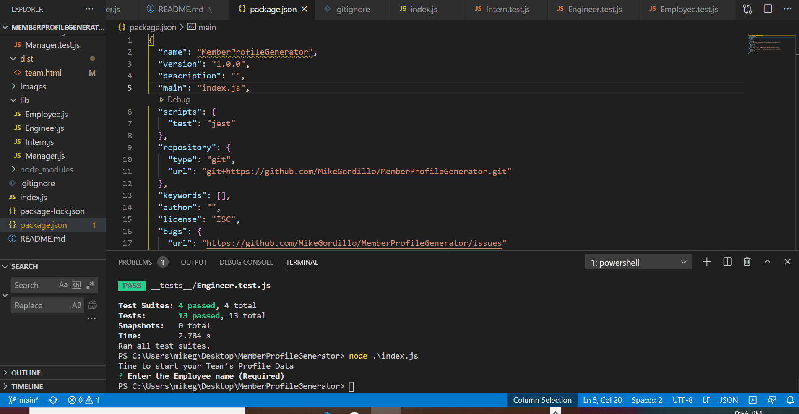
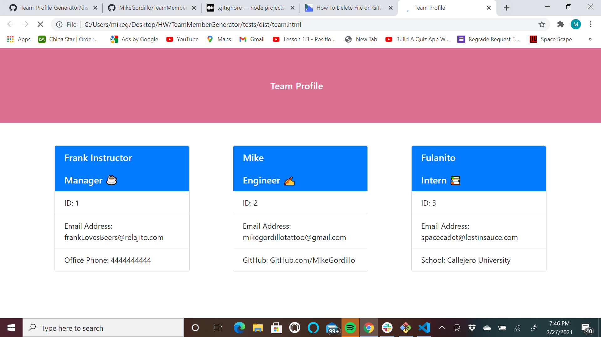

# Member Profile Generator

        
## Name:Mike Gordillo
## GitHub user name: gitHub.com/MikeGordillo

## Table of contents:  
* [Description](#description)
* [Installation](#Installation)
* [Usage](#usage)
* [License](#license)
* [Testing](#testing)
* [Questions](#questions)
        
## Description:
* This App creates a member profile card that dynamically displays html from your command line, when adding a new team member.
## Installation:
* download files on this repository and run index.js on node.js
## Usage:
* Simply answer the questions/ prompt after running index.js
## license:
* None
        
## Contributing:
* yes, just fork, and pull requests for approval
## Testing:
* npm run test
## Questions:
* Contact Mike Gordillo with any questions at mikegordillotattoo@gmail.com

https://github.com/MikeGordillo/MemberProfileGenerator

      